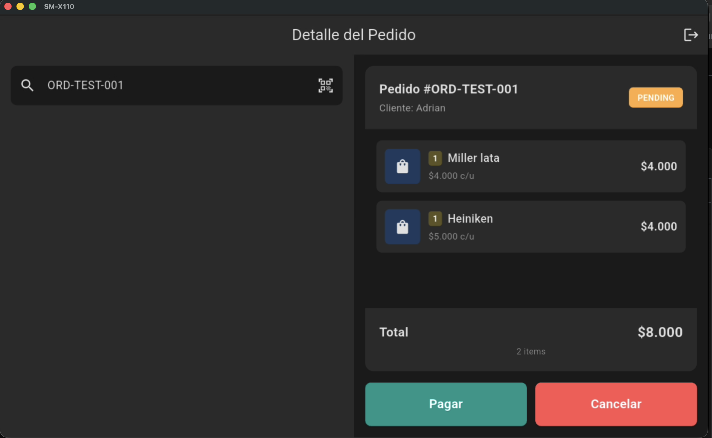

# EVNTS POS

Sistema POS (Point of Sale) para gestionar eventos en tiempo real. Aplicacion Flutter optimizada para tablet Android, conectada a Firebase como backend compartido con la app web del cliente.

## Demo



## Que hace

- **Login por rol** - Autenticacion con Firebase Auth (admin, cajero, bartender)
- **Buscar pedidos** - Busqueda por numero de orden conectada a Firestore en tiempo real
- **Cobrar pedidos** - Marcar como pagado con confirmacion visual (pantalla Success)
- **Cancelar pedidos** - Con dialogo de confirmacion antes de cancelar
- **Deteccion de estado** - Si el pedido ya fue pagado o cancelado, muestra aviso y permite buscar otro
- **Logout** - Cierre de sesion desde cualquier pantalla

## Stack

- **Flutter** (Dart) - UI optimizada para tablet Android
- **Firebase Auth** - Autenticacion por email/password con roles
- **Cloud Firestore** - Base de datos en tiempo real compartida con la web
- **Riverpod** - State management con StateNotifier + sealed classes
- **GoRouter** - Navegacion declarativa con redirect por rol
- **Clean Architecture** - Separacion por capas (domain/data/application/presentation)

## Proyecto relacionado

- [event-app](https://github.com/adrianferreiro/event-app) - App web React/TypeScript para el cliente (catalogo de productos, carrito, QR de ordenes)

## Setup

```bash
# Clonar el repo
git clone https://github.com/adrianferreiro/treintaypico.git

# Instalar dependencias
flutter pub get

# Configurar Firebase (necesitas firebase_options.dart y google-services.json)
flutterfire configure --project=<tu-proyecto>

# Correr en tablet
flutter run -d <device-id>
```

> **Nota:** Los archivos `firebase_options.dart` y `google-services.json` no estan en el repo por seguridad. Debes generarlos con FlutterFire CLI.
